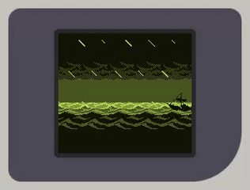

# Fame Boy

A Game Boy (DMG) emulator written in F#. Try it out in the browser [here](https://nickkossolapov.github.io/fame-boy/)!

 

[](https://github.com/nickkossolapov/fame-boy/actions/workflows/ci.yml)

### Features

- Supports most of the popular Game Boy games (incl. Tetris, Pokémon, Mario, Zelda, and more!).
- Runs [in the browser](https://nickkossolapov.github.io/fame-boy/) with a touch-friendly fully responsive design built with [Fable](https://fable.io/).
- Cross-platform too, it runs natively on Windows, macOS, and Linux (and others) with [Raylib](https://www.raylib.com/).
- Zero-dependency [F# core](./src/FameBoy) with robust typing and built with functional programming in mind.

### Limitations/TODOs

This was a development exercise for me, so I prioritised readability, idiomatic F#, and fun over pure performance and hardware accuracy.
It's quite far from being feature-complete, and here are some things that I may or may not get to (but would like to).

- No Game Boy Color support.
- No sound.
- Limited emulator configuration (no fast-forward, key remapping, or custom palettes).
- Missing battery saves (SRAM) and save states.
- Scanline-based rendering instead of using a pixel FIFO.
- Not super accurate (e.g. uses instant DMA transfer, missing a few hardware bugs).
- Only ROMs with MBC1, MBC3, and MBC5 are supported.

### Controls

| Game Boy | Key           |
|----------|---------------|
| D-pad    | W / A / S / D |
| A        | K             |
| B        | J             |
| Start    | N             |
| Select   | B             |

The web version also supports mouse/touch.

### Repo structure

- `FameBoy` - Core emulator library (CPU, PPU, memory, cartridges)
- `FameBoy.Raylib` - Native desktop frontend using Raylib
- `FameBoy.Web` - Browser frontend using Fable and Vite
- `FameBoy.Test` - Unit tests (NUnit)
- `FameBoy.Benchmark` - Performance benchmarks (BenchmarkDotNet)

## Getting Started

### Prerequisites

- [.NET 10 SDK](https://dotnet.microsoft.com/)
- [Node.js](https://nodejs.org/) (for the web project only)

### Run local build

#### Desktop

``` bash
dotnet run --project src/FameBoy.Raylib -- <rom-file> [scale]
```

`scale` is an optional positive integer that controls the window size multiplier (default: 4).

#### Web

``` bash
cd src/FameBoy.Web
npm install
npm run dev
```

This starts both Fable and Vite in watch mode.

### Create release builds

#### Desktop

``` bash
dotnet build ./src/FameBoy.Raylib/FameBoy.Raylib.fsproj -c release 
```

#### Web

``` bash
cd src/FameBoy.Web
npm run build
```

### Run tests

Covers most of the core emulator (except PPU rendering).

```bash
dotnet test
```

### Run benchmarks

The benchmark includes a few ROMs to run the emulator with in headless mode with [BenchmarkDotNet](https://benchmarkdotnet.org/).

``` powershell
./benchmark.ps1
```

Or directly:

``` bash
dotnet run --project src/FameBoy.Benchmark -c Release
```

## License

The Fame Boy source code is licensed under the [MIT License](./LICENSE).

This project redistributes an unmodified copy of [Tobu Tobu Girl DX](https://github.com/SimonLarsen/tobutobugirl) by Simon Larsen,
included under its original MIT/CC-BY licensing terms and is not covered by the above license.
