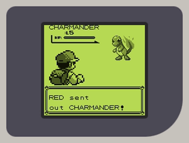
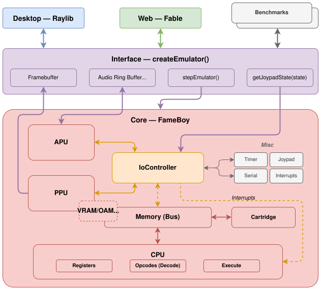
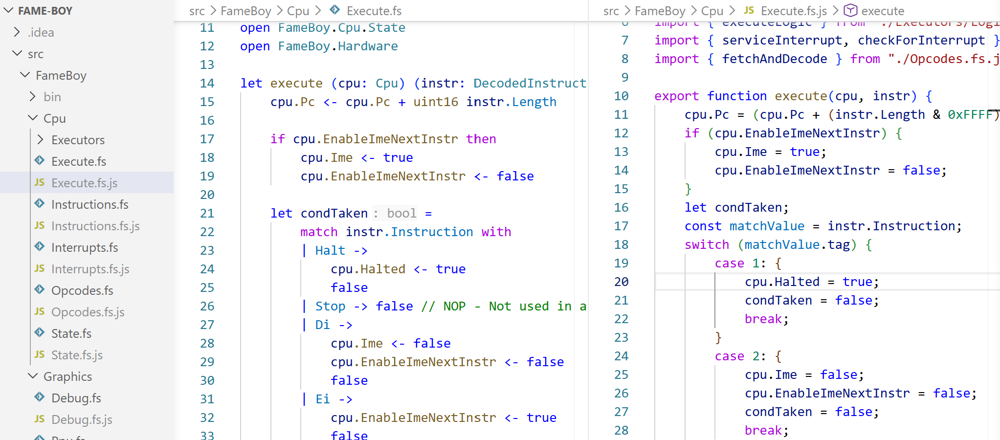
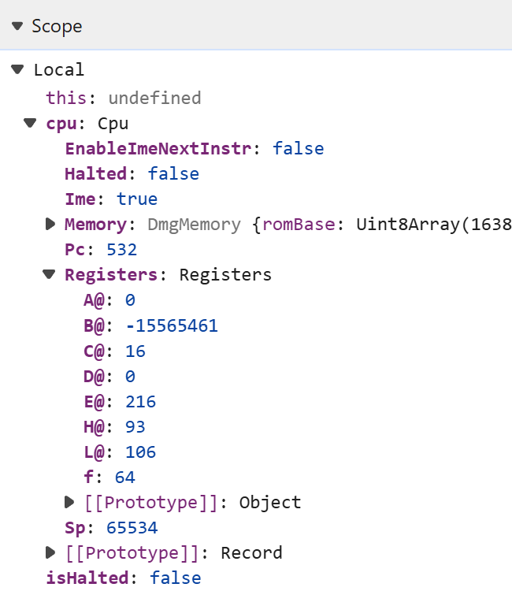
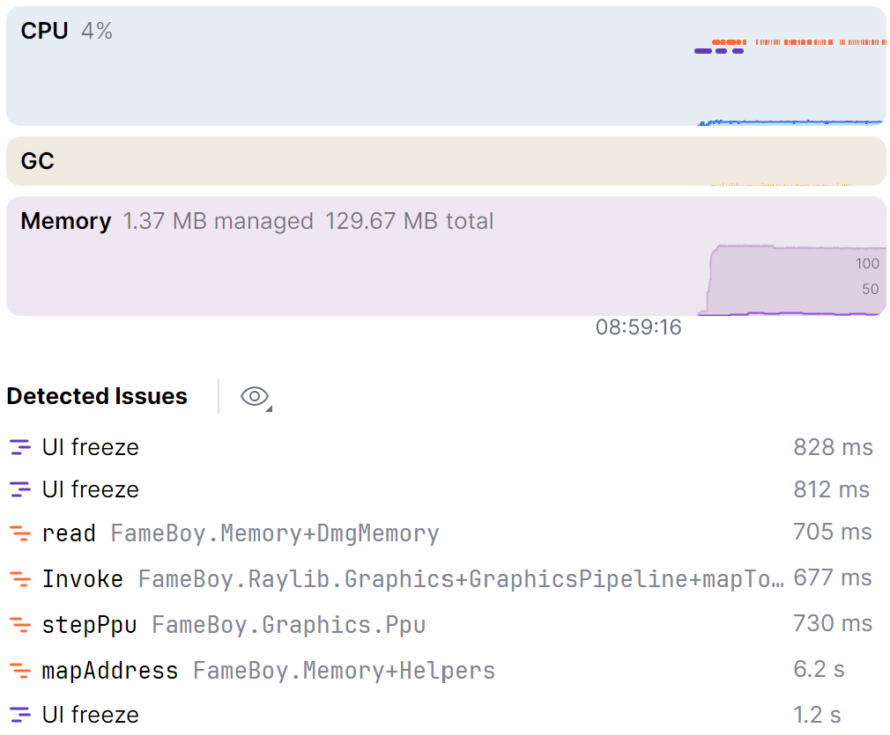

# I built a Game Boy emulator in F\#

I've been working as a software engineer for over 8 years at this point, and admittedly I've never understood how computers actually work. So I figured I'd try to learn how they work by emulating one. Sorry Ben Eater, I'm not going to build one just yet. 

I spent hundreds of hours as a kid catching Pokémon, so the Game Boy was the perfect candidate: real hardware, relatively simple in scope, and something with a strong personal connection.

Instead of jumping straight into it, I first did [From NAND to Tetris](https://www.nand2tetris.org/). It was a great course, and it made me really understand the fundamentals of computers, like registers, memory, and the ALU. Then to get used to building an emulator, I built a CHIP-8 emulator in F#: [Fip-8](https://github.com/nickkossolapov/fip-8).

A few months later, and after many nights of going to bed at 2 AM even though I told myself I'd only work on it for an hour or two, I have a working Game Boy emulator: Fame Boy. Complete with sound and running on desktop and web.. 

**[Play it in the browser](https://nickkossolapov.github.io/fame-boy/)** | **[View on GitHub](https://github.com/nickkossolapov/fame-boy)**

<div style="text-align: center;">
  
</div>

## How it works

I wanted to have the emulator work on both desktop and web, so I focused on having a simple interface between the emulator core and whatever frontend is running it.

The interface between the frontends and core is essentially just two arrays and two functions:
- `framebuffer` - a 160x144 array of shades (white, light, dark, black).
- `audiobuffer` - a ring audio buffer at sample rate of 32768 Hz with read and write heads.
- `stepEmulator()` - a function that executes one CPU instruction and returns the number of cycles taken.
- `getJoypadState(state)` - a callback for the frontend to give the emulator the joypad state, usually once a frame.

<div style="text-align: center;">
  
</div>

I tried to model Fame Boy in a similar way to the actual hardware of the Game Boy.

The [CPU](../src/FameBoy/Cpu/), like the real Sharp LR35902 in the Game Boy, knows nothing about the hardware except a memory map (and the IoController for interrupt signals only). It's also the most F#-ish part of my codebase, leaning heavily into functional domain modelling.

[Memory.fs](../src/FameBoy/Memory.fs) holds most of the RAM used in the Game Boy, and acts as the memory map and bus between the CPU, IO Controller, and cartridge. It also shares a reference to the same VRAM and OAM RAM arrays with the PPU for performance. 

[IoController.fs](../src/FameBoy/IoController.fs) emerged when I found myself adding too much logic to Memory.fs. While a singular IO controller doesn't exist in the Game Boy hardware, handling all the hardware registers through it simplified and added safety to the interfaces for the individual components. 

The `stepper` function in [Emulator.fs](../src/FameBoy/Emulator.fs) is the glue that brings the whole emulator together, composing all the components' individual step functions:

```fsharp
let stepper () =
	// Execute a single instruction
	// Each instruction uses a different amount of cycles
	let mCycles = stepCpu cpu io
	  
	for _ in 1..mCycles do  
	    stepTimers timer io  
	    stepSerial serial io
	    // The APU technically runs at 4x CPU-cycles, but can be batched
	    stepApu apu  
	  
	let tCycles = mCycles * 4  
	
	// The PPU operates at 4x CPU-cycles. The APU should be here too
	for _ in 1..tCycles do  
	    stepPpu ppu  
	
	// Return cycles taken so the frontend runs the emulator at the right speed
	mCycles 
```

While the real hardware components all run in parallel based on a central master oscillator, my emulator is single threaded and so the components have to run in sequence. The stepper function centralises the execution and ensures that all the components are synchronised.

Lastly, for the emulator to be playable it needs to run at the correct number of cycles per second, around 17500 CPU-cycles per 60 FPS frame. The frontends use the audio sampling rate to drive the emulator when the sound is on, and the frame rate to drive the emulator when it's muted. More on that later.

## Emulating the CPU, and F\#

First of all, I'd like to apologise to the functional programming purists. While [my CHIP-8 emulator](https://github.com/nickkossolapov/fip-8) is completely pure (no `mutable` members and all arrays are copied for none of that side-effect nonsense), Fame Boy uses mutability liberally. The Game Boy runs *a lot* faster than the CHIP-8, and copying 16+ kB of memory a million times every second didn't seem like the smart thing to do.

So, why F# for Fame Boy? Firstly, I think its extensive typing system works really well for modelling CPU instructions. Secondly, and more importantly, I just really like F#. I used to work primarily in F# at my previous company, and so I'm always looking for an excuse to keep on using it.

### Domain modelling

As an example why I think the CPU modelling works well in F#, I was following [Gekkio's Complete Technical Reference](https://gekkio.fi/files/gb-docs/gbctr.pdf) when implementing the CPU. I grouped the instructions like the reference, and ended up with something like this in [Instructions.fs](../src/FameBoy/CPU/Instructions.fs):

```fsharp
type LoadInstr =  
    | Load8Immediate of uint8
    | Load8Direct of Register
    | Load8Indirect
    // ... other load instructions

type ArithmeticInstr =  
    | IncrementDirect of uint8
    | IncrementIndirect of Register
    // ... other arithmetic instructions
```

And it wasn't just the load instructions. A lot of the other instructions shared similar concepts, like the location of the instruction's operand: 
- read the byte value immediately after the instruction in memory (`immediate`),
- read/write a CPU register (`direct`), 
- read/write a memory location specified by the HL CPU register (`indirect`). 

Even though this is a small domain and most Game Boy devs know the opcodes/instructions basically as is, I felt like it could be neatened up. The code below shows the extraction of the location concept. The code uses different names and order from the source code to make the load instruction more readable for anyone not familiar with F#'s DU.

```fsharp
type To =  
	| Direct of Register
	| Indirect

type From =
	| Immediate of uint8  
	| Direct of Register
	| Indirect

type LoadInstr =  
    | Load of From * To // These form a tuple, like Load<From, To> in C#
    // ... other instructions
```

This helped reduce the CPU instructions down from 512 opcodes to just 58 instructions. Generalising a domain like this risks allowing invalid states, but using a good type system can avoid them. 

For example, if I had used a location type, `Loc`, instead of the `From` and  `To` types, this instruction would compile without any complaints: `Load(Loc.Direct D, Loc.Immediate)` (storing a register to the immediate value). The Game Boy's hardware (its domain) doesn't support writing to the immediate value, so the domain would contain an illegal state.

By using the F# type system to model the domain correctly, you get a guarantee that illegal states can't be expressed in your system. You don't necessarily need unit tests, it just won't compile. So with simplified types Fame Boy still captures exactly what the Game Boy's CPU supports and nothing more (with one cheeky exception).

Now the eagle-eyed Game Boy emulator devs would say to me "hey Nick, but what about the opcode 0x76?", and I would reply "A monad is a monoid in the category of endofunctors" to show that I'm using a functional programming language and therefore smarter than them.

Joking aside though, it's a compromise I decided on because I felt it simplified the CPU domain a lot. If you look at the patterns that the opcodes follow, `0x76` would be `Load(From.HL, To.HL)`, or load the 8-bit value from the memory at location HL to the memory at location HL, which my emulator's typing allows. Logically, it's a NOP and not dangerous, and the opcode reader will actually decode that opcode to `HALT` as it does in the Game Boy. But it's a notable blemish in what I think is otherwise a decent domain model.

Now you can do something similar in most languages, but if you've worked with a functional language it's hard to properly describe how smooth it feels working with these types. After using a `match` statement or Options in F#, going back to a `switch` statement feels clunky and prone to mistakes. For anyone who hasn't worked with a functional programming language I'd recommend you go out and try one.

### Keep it simple, stupid

Since the goal of this project was to learn about computer hardware rather than building the best emulator, I almost never looked at other emulators' code in depth. However, while casually browsing the source code for [CAMLBOY](https://github.com/linoscope/CAMLBOY), I spotted lines like this:

```ocaml
set_flags ~h:false ~z:(!a = zero) ();
```

I really liked that you could pass in however many flags you wanted, in any order. And since they are just named parameters for the method, the performance overhead is minimal.

But I couldn't create something exactly like it because F# avoids method overloading and default parameters due to its type system supporting partial application. Instead I settled on something like this:

```fsharp
cpu.setFlags [ Half, false; Zero, a = 0uy ]
```

It never sat well with me, it required an array and a flag type (e.g. `Half`). But I carried on anyway as I wanted to make progress. As I got near the end, I spent a lot of time revisiting my old code and refactoring, and wanted to try and improve the setFlags function. So after a lot of mulling over and trying out other approaches, I ended up with this ([Cpu/State.fs L81](../src/FameBoy/Cpu/State.fs#L81)):

```fsharp
module Flags =
	let inline setZ (v: bool) (f: uint8) =
		if v then f ||| ZMask else f &&& ~~~ZMask
	 
	let inline setH (v: bool) (f: uint8) =
		// ... the other flag functions and definitions

// Other files
cpu.Flags <- 
	cpu.Flags 
	|> setH false
	|> setZ (a = 0uy)
```

 The functions are exactly what I wanted. Effortlessly composable and testable, just simple pure functions. *Chef's kiss*. 
 
 The previous function required hoisting the values into DU types and putting them in an array, and the setFlags function was more verbose as a result. Furthermore, because the functions are inline and don't require any heap allocations, the new functions are actually much more performant, they increased the emulator's FPS by about 10%. 
 
 I think that simple 16-line Flags module is possibly my favourite F# I've ever written.

### Testing

I initially tackled the CPU with just this function and running the Tetris ROM:

```fsharp
match opcode with  
| 0x00 -> Nop  
| _ -> failwith "Unimplemented opcode"
```

And then every time it hit that exception I would implement the instruction for that opcode. I quickly hit two issues with this approach: the loop was getting a bit tedious navigating around technical references randomly instead of focusing on groups of instructions at a time, and I had no idea if I was actually implementing the instructions correctly. Fixing both of these was simple: unit tests.

This is where AI really came in handy. To improve my learning I wanted to write the emulator code myself, but coming up with test cases would be tedious, and I might have tunnel vision and miss some important test cases. So I had two prompts I used where I included the spec from the technical docs, and asked AI to write tests for those specs without looking at the emulator code. While it was busy I read the spec myself, and then implemented the logic until the tests passed: true test-driven development. It even helped catch a few bugs in the existing instructions I had already implemented. 

I did regularly review and improve the tests, but overall I feel it didn't detract from my learning at all, and helped me spend my energy on the things that were actually interesting to me.

## Beyond the CPU

### PPU

The Game Boy doesn't have a GPU, it has a PPU, picture processing unit. Although in my mind it actually stands for pixel processing unit. I spent more time focused on the individual pixels than any sort of picture.

This is the part that surprised me when it came to blogs from other people who made Game Boy emulators. Many blogs focused on the CPU, with only a few paragraphs for the PPU. Maybe it's because I was fresh off of From Nand to Tetris and the CHIP-8 emulator, the CPU felt natural while the PPU took a lot longer to understand. But now that I've implemented it, I can see why. It's less about designing your own system, and more about just following the steps needed to get the pixels on the screen, mechanical work rather than creative.

At the start of implementing the PPU, I was a bit lost on what to do. So rather than trying to grok the pixel FIFOs and full PPU pipeline all at once, I just decided to read the tile and background map from memory, parse the data, and just put it on the screen (the right part of the screenshot below). I could finally see my CPU working, and thanks to Tetris' simplicity, I could see something that was *mostly* a real Game Boy game. It felt great seeing it for the first time.

<div style="text-align: center;">
  
</div>

And for the PPU, starting with the tile and background view was a great place to start in retrospect. It helped me at pretty much every point in the process, from implementing the actual screen to debugging the annoying little details with the sprite data. 

Overall I was happy with how the PPU turned out, but it has possibly the biggest hardware inaccuracy in my emulator. The Game Boy uses a FIFO queue to put pixels on the screen one at a time like a CRT monitor, but my emulator renders the entire scanline at the start of the draw period for that line. It's faster and kept the code simpler, plus the games I wanted to play all work, so I haven't felt the need to move to pixel queues. There are games where the devs took the Game Boy hardware to its limits and exploited the pixel queue timings, and those don't really work with Fame Boy. But most games aren't that adventurous with the hardware, and should mostly work.

### Joypad

Besides the big ones (PPU and APU), I also want to talk about the joypad. The initial implementation was a breeze. It was straightforward and easy to write tests for.

But after pretty much any major refactor it would always end up breaking. The joypad hardware register is one where the CPU and game both read from and write to it, so they interact with each other in ~~frustrating~~ interesting ways.

An example, in the early stages of the emulator I made the CPU write the joypad state to the register every cycle. But that's inefficient, humans don't change buttons a million times every second, so I changed it to only update once a frame. Then the d-pad stopped working. Some reading later, and even though I knew that the Game Boy's hardware only allows half the buttons to be read at a time, I discovered that games almost always do at least two joypad register reads in short succession, relying on the register changing between the reads. Games do this so they can read the state of all the buttons. But now the register is cached and doesn't change and half the buttons don't work. Oh joy.

In the end I made the IoController update the joypad register only when it's read by the CPU, but I probably should have spent some time and come up with an integration test for it. More on [the joypad in Pandocs](https://gbdev.io/pandocs/Joypad_Input.html) for those interested.

### Sound is hard

After I had finished and had a working emulator, I fleshed out the repo's readme and was preparing to write this. But I was playing around with the web version and thought it felt a bit empty without the sound. And so I went ahead to try and add the APU, audio processing unit (first mistake). I read a few blogs, and found that many emulators use the frontend audio sampling rate to drive the emulator, rather than the framerate. This sounded backwards to me, so I researched dynamic sampling rates and decided to use that with the framerate driving the emulator instead (second mistake).

Sound was the most challenging component for me conceptually. It took me a while to understand how the different sound registers and channels work. This is where AI as a teacher really shone. I had a lot of back and forth before trying to start coding. But much like the PPU, it was really satisfying as I completed each channel. And by doing one channel at a time, it helped me understand how music is actually formed. Hearing the Tetris song slowly come together and build up richness actually brought a smile to my face.

It wasn't all sunshine and rainbows though. The CPU and PPU are basically just "once per frame, do exactly X number of things,", and you can calculate X easily. And instead of just calculations, the APU on the other hand has so many things to choose and tune. 

The only easy thing to choose was the APU's sampling rate. The actual Game Boy's APU was flexible, so emulators can use whatever sampling rate they want. I went with 32768 Hz, because that comes to 1 sample every 128 CPU cycles (1 048 576 Hz, and 1 048 576 / 32 768 = 128). So my APU state can use integers and still stay perfectly in sync. 128 is also divisible by 4, so I could batch the APU steps 4 at a time and never miss alignment with a CPU instruction.

All the other things though, much more wonky. I'm not a sound engineer, so I was just changing values hoping for the best. And worst of all, not only did each frontend have its own quirks, but each platform did too. I got the sound working well on PC, but when I tried it out on a MacBook it sounded like a waterfall. I fixed the MacBook, and suddenly the desktop version on PC doesn't even run because of a race condition.

After hours of tweaking settings and failing, I abandoned trying to be clever with the dynamic sampling rates, and moved to having audio drive the emulator. That made audio much more reliable between all the devices.

It's also definitely the leakiest part of the emulator-frontend interface, but that's because audio does need to be precisely synced to avoid a cacophony.

## Driving the emulator

To explain the difference between audio-driven and frame-driven, it's more about understanding human perception. 

You know when you're listening to something, and it pops? There was a drop in the audio signal, so the speaker suddenly moves a lot due to the sudden change in the signal, creating a pop. The same thing happens when a video stutters, there wasn't enough data coming in on time and so the video player has to skip a frame or two. Only now it's not pushing something physical, so it's less offensive to our senses. 

Now back to driving the emulator. In Fame Boy, both audio and video are perfectly synced, because that's how it's designed. But the computer running it has independent audio and video, and either may occasionally fall behind. So when the frontend's audio and video are out of sync, it has one of two options to try:

1. Keep the frontend audio and emulator audio in sync, and occasionally drop frames
2. Keep the frontend video and emulator frames in sync, and occasionally drop audio 

So the one you choose "drives" the emulator, while still trying to keep the other one close. Driving with the frame rate is fairly straightforward. Here's a simplified version:

```fsharp
let mutable cycles = 0

while (runEmulator) do  
	cycles <- cycles + targetCyclesPerMs * lastFrameTime
	  
	while cycles > 0 do
	    let cyclesTaken = stepEmulator () 
	    cycles <- cycles - cyclesTaken
	
	draw ppu.framebuffer
```

Sound is a bit more tricky, as Raylib and Web Audio handle audio differently. The general flow is:

```fsharp
let tryQueueAudio apu stepEmulator =
	if frontend.audioBuffer.hasSpace () then
		while apu.writeHead - apu.readHead < samplesNeeded do
			stepEmulator ()
		
		frontend.audioBuffer.fill apu.audioBuffer


while (runEmulator) do  
    tryQueueAudio apu stepEmulator
    
    draw ppu.framebuffer
```

The key difference is that stepEmulator is no longer controlled by `lastFrameTime`. Instead, it's driven by the frontend's audio buffer needs. `samplesNeeded` needs to be calculated so that `stepEmulator` is called the right number of times to match the different sampling rates and to produce 60 FPS.

However, the frontend's audio buffer only cares about filling itself, so it sometimes calls `stepEmulator` too many or too few times per frame, which results in the framebuffer not being updated in time.

You can actually try out the frame-driven version of the web frontend by adding [?frame-driven](https://nickkossolapov.github.io/fame-boy/?frame-driven) as a query parameter in the URL. It should be visually smoother, but there will be the occasional audio pop. Also, even the audio-driven web frontend switches to being frame-driven when the mute button is pressed, as those pops won't be audible anyway.

My implementation of this is far from perfect, though. Ultimately, I found the audio pops to leave a worse impression than frame stutters, and leaving the emulator muted made it feel empty, and so I decided to make audio-driven the default in the web frontend. Audio is one of the few areas of Fame Boy I'm not quite happy with, and would like to revisit someday.

## Taking it to the web with Fable

After I had gotten the PPU somewhat working and could see some things happening on the screen on the desktop, I was excited to try to move Fame Boy to the web. I hopped onto the [Fable](https://fable.io/) docs, installed a package, set up the main loop, added some styling, and within an hour or two I was ready to try and run it. I hit enter, and then:

<div style="text-align: center;">
  
</div>

Maybe this version of Tetris set in winter in Siberia. I tried debugging the issue for a bit, but instead of spending too much time on it I just moved on to trying WebAssembly with [Blazor](https://dotnet.microsoft.com/en-us/apps/aspnet/web-apps/blazor). It was also similarly easy to get up and running, and this time it actually worked. 

But there was a problem, it was nigh unplayable, getting maybe 8 FPS. I'm still not sure what the issue is. I don't think it was Blazor itself, the .NET team did publish performance guides that I tried to follow, but they didn't help in the end. Debugging was also a pain, so I reluctantly went back to Fable to look into what could be going wrong with the transpilation into JavaScript. 

To my surprise, Fable puts the transpiled JS files right next to the source code, and it's actually quite readable.

<div style="text-align: center;">
  <picture>
    <source srcset="./images/transpiled_fs_dark.png" media="(prefers-color-scheme: dark)">
    
  </picture>
</div>

This made understanding the new code, and also debugging in the browser dev tools, quite straightforward. And when looking at the dev tools I noticed something was a bit wrong.

<div style="text-align: center;">
  <picture>
    <source srcset="./images/web_cpu_dark.png" media="(prefers-color-scheme: dark)">
    
  </picture>
</div>

The CPU registers in Fame Boy (and the Game Boy too) are 8-bit unsigned integers, so in the range 0-255. I'm not an expert, but I don't think -15565461 is an 8-bit number. I went through the transpiled code and the Fable docs and found [this](https://fable.io/docs/javascript/compatibility.html#numeric-types):

> (non-standard) Bitwise operations for 16 bit and 8 bit integers use the underlying JavaScript 32 bit bitwise semantics. Results are not truncated as expected, and shift operands are not masked to fit the data type.

That would explain the rampant B register. Hunting through the code to find all the places where 8-bit values needed to be truncated, I managed to [find all the offenders](https://github.com/nickkossolapov/fame-boy/commit/05ec0cfa55ce3f31f9006068ed6327d9db5fd81b), and voilà, the frontend worked perfectly. And since it's pure JS, the web bundle is only around 100 kB. 

Outside of the weird uint8 issue (which most people shouldn't have), I had a fairly pleasant experience with Fable. It was rather smooth, and it meant that all of the source code stays in F#. 

## Trying to improve performance

Once I had gotten things showing on the screen, I was curious what performance was like. I added a simple FPS console log. At that point it was around 55-60 FPS in debug mode. Not great, not terrible. I think that was due to Raylib trying to maintain v-sync though, as turning it off the emulator jumped to around 70 FPS, but was jittery. I can always optimise later, and so I decided to power on with the PPU. 

As I added more features, performance slowly dropped, eventually reaching 45 FPS, and turning off v-sync didn't help. Later had arrived, so it was time to optimise. I fired up the profiler in JetBrains Rider, and saw this:

<div style="text-align: center;">
  <picture>
    <source media="(prefers-color-scheme: dark)" srcset="./images/profiling_dark.png">
    
  </picture>
</div>

`mapAddress` looked very suspect. Virtually every component accesses the memory, but why is it so much higher than the rest? I drilled down into the other function calls (like `stepPpu`), and found everything was spending more time than I expected on accessing memory. So I went to the offending code:

```fsharp
type MemoryRegion =  
    | RomBase of offset: int  
    // ... others
    
let mapAddress (addr: int) : MemoryRegion =
        match addr with
        | a when a < 0x4000 -> RomBase a
        // ... others
    
type DmgMemory(arr: uint8 array) =
	// Arrays for romBase etc

	member this.read address =  
	    match mapAddress address with
	    | RomBase i -> romBase[i]  
	    // ... others 
  
	member this.write address value =  
	    match mapAddress address with  
	    | RomBase _ -> ()  
	    // ... others 
```

I was still running high on my domain-driven development rush with the CPU, and tried to extend it to the memory. This meant that every single memory read or write created a `MemoryRegion` object, resulting in tens of millions of object allocations to the heap every second. That poor garbage collector was working overtime. I removed the DU and just accessed the arrays directly, and that [one change](https://github.com/nickkossolapov/fame-boy/commit/bdb8533be647711b9e07d3bc63441b7fad3b362a) doubled my FPS. 

There were more times where I moved to structs (which live on the stack) or go with other not-as-F#-friendly approaches. The PPU was the point where optimization became necessary, and I had to abandon idiomatic F# to an extent.

I slowly improved performance by spending time regularly looking at the profiler, eventually getting it up to about 120 FPS. But then I found the biggest improvement in FPS. The fix? Turning off the debug build, taking the emulator to a lightning-fast 1000 FPS. It took me embarrassingly long to realise that debug mode is that much worse than release mode. I continued to regularly monitor performance and tweak things even up until the end.

## Benchmarks

Just looking at FPS numbers in the console didn't seem like a great way to measure performance. So partway through the project I added a [BenchmarkDotNet project](../src/FameBoy.Benchmark/Program.fs) to measure desktop performance, and later made a simple [web benchmarker](../src/FameBoy.Benchmark.Web/Program.fs) using Node.js to perform similar benchmarks to estimate web browser performance.

The benchmarks all used the following demo ROMs, used to test realistic scenarios:
- [Flag](https://hh.gbdev.io/game/flag-demo) - a short loop with no sound
- [Roboto](https://hh.gbdev.io/game/roboto-demo) -  a long-running (>1 min) demo that uses many visual effects and has sound.
- [Merken](https://hh.gbdev.io/game/merken) - similar to Roboto, but uses a memory banked ROM to test the memory.

Here is desktop FPS performance on both a Ryzen 9 7900 Windows PC and a M4 MacBook Air.

| CPU          | Flag | Roboto | Merken |
| ------------ | ---- | ------ | ------ |
| Ryzen 9 7900 | 1785 | 1943   | 1422   |
| Apple M4     | 1907 | 2508   | 1700   |

And here is the web FPS performance.

| CPU          | Flag | Roboto | Merken |
| ------------ | ---- | ------ | ------ |
| Ryzen 9 7900 | 646  | 883    | 892    |
| Apple M4     | 779  | 976    | 972    |

Fame Boy performs decently well on both platforms. 

Surprisingly, the APU (sound) had more of an impact on emulator performance than the PPU. Disabling the PPU increases desktop performance by about 250 FPS, while disabling the APU increases it by around 500 FPS.

## It's 2026, so a note on AI

No code is free from the influence of AI these days, even learning projects. In general I strive to be transparent about my AI usage, and so I wanted to comment on how I used it and my experience with it in a purely learning project.

Throughout the process I tried to mostly use AI as an aid. I regularly asked it for code reviews, as a wall to bounce ideas off of, and to explain any terse technical documents. I tried to minimise the use of AI-written code though. I wanted to make something that I can show to people and be proud of. Code, for humans, by a human. If I wanted nothing more than an emulator I could've just shared the prompt. 

There were two noteworthy cases with AI in my project. One was at the end where I decided to just burn some tokens, and unleashed the CLI on my repo to try to find performance improvements. I gave it some ideas, and asked it to try anything else it wanted to. It did really well, more than doubling the performance for some of the benchmarks ([PR link with details](https://github.com/nickkossolapov/fame-boy/pull/1)). It did introduce some bugs that I found and had to fix though.

The other was a case where AI actually saved this project when I had nearly given up. If you look through the git history in my repo, you'll find a rather large gap at one point. I call it the "timer winter".

<div style="text-align: center;">
  
</div>

It wasn't that I didn't work on the emulator, I was just stuck on a bug. I could never get past the copyright screen in Tetris, no matter what I tried. I probably spent over 20 hours debugging, scanning the emu-dev Discord, creating tests, and even throwing the issue at earlier AI models. Nothing worked. But then after a few weeks away from the emulator I tried Claude Opus, and it found the issue in just a few minutes. The fix?

```fsharp
// Before
stepTimers timer memory // only once per instruction

// After
for _ in 1..cpuCycles do // cpuCycles can vary between 1 and 6
	stepTimers timer memory
```

This meant the timer ran on average two to three times slower than it should have, so the copyright just stayed up longer. FFS. Apparently I never waited a minute or two to see that it actually would have worked.

Now on to this post itself. 

In the sprawling tapestry of our digital landscape—a world defined by rapid evolution—this post wasn't just written—it was meticulously curated. Every word stands as a testament—a nuanced beacon of intentionality—proving that human connection matters more than ever in today’s shifting paradigm.

Writing is not merely about data—it is about the symphony of connection—a vibrant medium for shared vulnerability. It is about unlocking our potential—leaning into the journey—and showing up authentically to navigate the complex interplay of our collective human experience.

*cough*

It was mostly written by me.

## Did I actually learn anything?

My main goal was to learn how computers work, and to that end it was a great success. And even more important than that, I had a really fun time. I would turn on my computer after work thinking "okay, just one feature tonight". And next thing I know it's 2 AM and I keep telling myself I should go to bed after one more bugfix.

I was thinking about trying out the Game Boy Advance, but looking at the specs it feels like it's 3 times the effort for maybe a 20% increase in my understanding of hardware. I think the Game Boy struck a great balance to help me learn, and so I might stop here for now.

Did it make me a better software engineer? Probably not. Do I feel better knowing I understand a bit more about the tool I use every day? Certainly.

Thanks for reading!

Feel free to [email me](mailto:riveter_stapes_4v@icloud.com) if you have any questions or comments.


