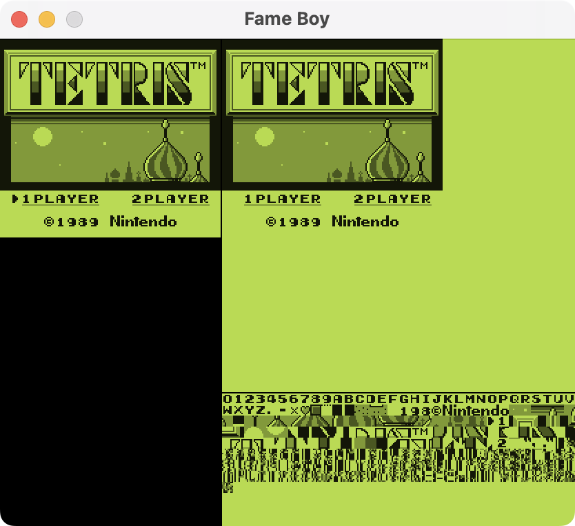
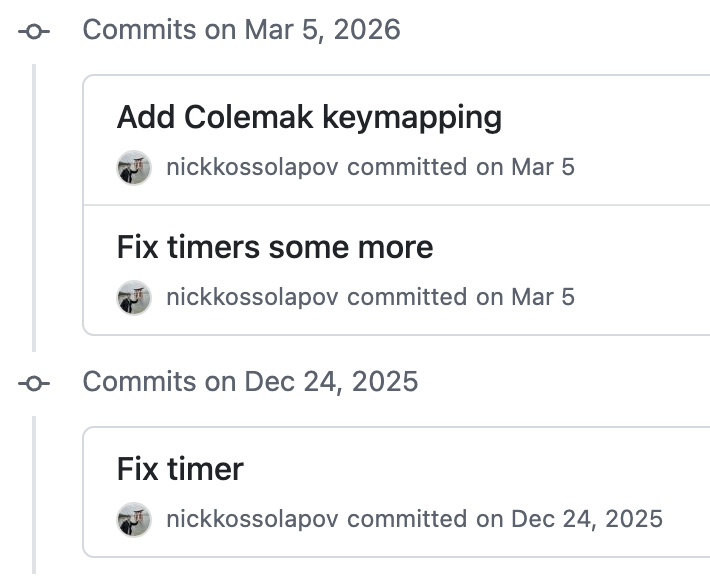

# Building a Game Boy emulator in F\#

I've been working as a software engineer for over 8 years at this point, and admittedly I've never understood how computers actually work. So I figured I'd try to learn how they work by emulating one. Sorry Ben Eater, I'm not going to build one just yet. 

I spent hundreds of hours as a kid catching Pokémon, so the Game Boy was the perfect candidate: real hardware, relatively simple in scope, and something with a strong personal connection.

Instead of jumping straight into it, I first did [From NAND to Tetris](https://www.nand2tetris.org/). It was a great course, and it made me really understand the fundamentals of computers, like registers, memory, and the ALU. Then to get used to building an emulator, I built a CHIP-8 emulator in F#: [Fip-8](https://github.com/nickkossolapov/fip-8).

A few months later, and after many nights of going to bed at 2 AM even though I told myself I'd only work on it for an hour or two, I have a working Game Boy emulator: Fame Boy. 

Check out the source code on [GitHub](https://github.com/nickkossolapov/fame-boy), or try it out in the browser [here](https://nickkossolapov.github.io/fame-boy/)!


## How it works

I wanted to have the emulator work on both web and desktop, so I focused on having a simple interface between the emulator core, and whatever frontend is running it.

The interface between the frontends and core is essentially just two arrays and two functions:
- `framebuffer` - 144 \* 160 length array of shades (white, light, dark, black).
- `audiobuffer` - a ring audio buffer at sample rate of 32768 Hz with read and write heads.
- `stepEmulator()` - a function that executes one CPU instruction and returns the number of cycles taken.
- `getJoypadState(state)` - a callback for the frontend to give the emulator the joypad state, usually once a frame.


I tried to model Fame Boy in a similar way to the actual hardware of the Game Boy.

The [CPU](../src/FameBoy/Cpu/), like the real Sharp LR35902 in the Game Boy, knows nothing about the hardware except a memory map (and the IoController for interrupt signals only). It's also the most F#-ish part of my codebase, leaning heavily into functional domain modelling.

[Memory.fs](../src/FameBoy/Memory.fs) holds most of the RAM used in the Game Boy, and acts as the memory map and bus between the CPU, IO Controller, and cartridge. It also shares a reference to the same VRAM and OAM RAM arrays with the PPU for performance. 

[IoController.fs](../src/FameBoy/IoController.fs) emerged when I found myself adding too much logic to Memory.fs. While a singular IO controller doesn't exist in the Game Boy hardware, handling all the hardware registers through it simplified and added safety to the interfaces for the individual components. 

The `stepper` function in [Emulator.fs](../src/FameBoy/Emulator.fs) is the glue that brings the whole emulator together, composing all the components' individual step functions:

```fsharp
let stepper () =
	// Execute a single instruction
	// Each instruction uses a different amount of cycles
	let mCycles = stepCpu cpu io
	  
	for _ in 1..mCycles do  
	    stepTimers timer io  
	    stepSerial serial io
	    // The APU technically runs at 4x CPU-cycles, but can be batched
	    stepApu apu  
	  
	// The PPU operates at 4x CPU-cycles, but can't be batched
	let tCycles = mCycles * 4  
	  
	for _ in 1..tCycles do  
	    stepPpu ppu  
	
	// Return cycles taken so the frontend run the emulator at the right speed
	mCycles 
```

While the real hardware components all run in parallel based on a central master oscillator, my emulator is single threaded and so the components have to run in sequence. The stepper function centralises the execution and ensures that all the components are synchronised.

Lastly, for the emulator to be playable it needs to run at the correct number of cycles per second, around 17500 CPU-cycles per 60 FPS frame. The frontends use the audio sampling rate to drive the emulator when the sound is on, and the frame rate to drive the emulator when it's muted. More on this later in the chapter about sound.

## Emulating the CPU, and F\#

First of all, I'd like to apologise to the functional programming purists. While [my CHIP-8 emulator](https://github.com/nickkossolapov/fip-8) is completely pure (no `mutable` members and all arrays are copied for none of that side-effect nonsense), Fame Boy uses mutability liberally. The Game Boy runs *a lot* faster than the CHIP-8, and copying 16+ kB of memory a million times every second didn't seem like the smart thing to do.

So, why F# for Fame Boy? Firstly, I think its extensive typing system works really well for modelling CPU instructions. Secondly, and more importantly, I just really like F#. I used to work primarily in F# at my previous company, and so I'm always looking for an excuse to keep on using it.

### Domain modelling

As an example why I think the CPU modelling works well in F#, I was following [Gekkio's Complete Technical Reference](https://gekkio.fi/files/gb-docs/gbctr.pdf) when implementing the CPU. I grouped the instructions like the reference, and ended up with something like this in [Instructions.fs](../src/FameBoy/CPU/Instructions.fs):

```fsharp
type LoadInstr =  
    | Load8Immediate of uint8
    | Load8Direct of Reg8
    | Load8Indirect
    // ... other load instructions

type ArithmeticInstr =  
    | IncrementDirect of uint8
    | IncrementIndirect of Reg8
    // ... other arithmetic instructions
```

And it wasn't just the load instructions. A lot of the other instructions shared similar concepts, like location of the instruction's operand: 
- read the byte value immediately after the instruction in memory (`immediate`),
- read/write a CPU register (`direct`), 
- read/write a memory location specified by the HL CPU register (`indirect`). 

Even though this is a small domain and most Game Boy devs know the opcodes/instructions basically as is, I just felt like it could be cleaner. The code below shows the extraction of the location concept. The code uses different names from the source code to make the load instruction more readable for anyone not familiar F#'s DU.

```fsharp
type To =  
	| Immediate of uint8  
	| Register of Register // direct
	| HL // indirect

type From =  
	| Register of Reg8  // direct
	| HL // indirect

type LoadInstr =  
    | Load of From * To // These form a tuple, like Load<From, To> in C#
    // ... other instructions
```

This helped reduce the CPU instructions down from 512 opcodes to just 58 instructions. Generalising a domain like this risks allowing invalid states, but using a good type system can avoid those. 

For example, if I had used a location type, `Loc`, instead of the `From` and  `To` types, this instruction would compile without complaining: `Load(Loc.Register D, Loc.Direct)` (storing a register to the immediate value). The Game Boy's hardware (its domain) doesn't support this, so the domain would contain an illegal state.

Using the F# type system to model the domain correctly, you get a guarantee that illegal states can't be expressed in your system. You don't necessarily need unit tests, it just won't compile. So with simplified types Fame Boy still captures exactly what the Game Boy's CPU supports and nothing more (with one cheeky exception).

Now the eagle-eyed Game Boy emulator devs would say to me "hey Nick, but what about the opcode 0x76?", and I would reply "A monad is a monoid in the category of endofunctors" to show that I'm using a functional programming language and therefore smarter than them.

Joking aside though, it's a compromise I decided on because I felt it simplified the CPU domain a lot. If you look at the patterns that the opcodes follow, `0x76` would be `Load(From.HL, To.HL)`, or load the 8 bit value from the memory at location HL to the memory at location HL, which the emulator's typing allows. Logically, it's a NOP and not dangerous, and the opcode reader will actually decode that opcode to `HALT` as it does in the Game Boy. But it's a notable blemish in what I think is otherwise a decent domain model.

Now you can do something similar in most languages, but if you've worked with a functional language it's hard to properly describe how smooth it feels working with these types. After using a `match` statement or Options in F#, going back to a `switch` statement feels clunky and prone to mistakes. For anyone who hasn't worked with a functional programming language I'd recommend you go out and try one.

### Keep it simple, stupid

Since this goal of this project was to learn about computer hardware rather than building the best emulator, I almost never looked at other emulators' code in depth. However, while casually browsing the source code for [CAMLBOY](https://github.com/linoscope/CAMLBOY), I spotted lines like this:

```ocaml
set_flags ~h:false ~z:(!a = zero) ();
```

(CAMLBOY is a great repo btw, with a pretty good blog post. You should check it out).

I really liked that you could pass in however many flags you wanted, in any order.

But I couldn't find something exactly like it because F# avoids method overloading and default parameters due its type system supporting partial application. Instead I settled on something like this:

```fsharp
cpu.setFlags [ Half, false; Zero, a = 0uy ]
```

It never sat well with me, but I carried on anyway as I wanted to make progress. As I got near the end, I spent a lot of time revisiting my old code and refactoring, and wanted try and improve the setFlags function. So after a lot of mulling over and trying out other approaches, I ended up with this ([Cpu/State.fs L81](../src/FameBoy/Cpu/State.fs#L81)):

```fsharp
// Cpu/State.fs Flags module
let inline setZ (v: bool) (f: uint8) =
	// Game Boy flags are just certain bits in the F CPU register
    if v then f ||| ZMask else f &&& ~~~ZMask

// Other files
cpu.Flags <- 
	cpu.Flags 
	|> setH false
	|> setZ (a = 0uy)
```

 The functions are the exactly what I wanted. Effortlessly composable and testable, just simple pure functions. *Chef's kiss*. The previous function required hoisting the values into DU types and putting them in an array, and the setFlags function was more verbose as a result. Furthermore, because the functions are inline and don't require any heap allocations, the new functions are actually much more performant, increasing the emulator's performance by about 10%. I think that simple 16 line Flag module is possibly my favourite F# I've ever written.

### Testing

I initially tackled the CPU with just this function and running the Tetris ROM:

```fsharp
match opcode with  
| 0x00 -> Nop  
| _ -> failwith "Unimplemented opcode"
```

And then every time it hit that exception I would implement the instruction for that opcode. I quickly hit two issues with this approach: the loop was getting a bit tedious navigating around technical references randomly instead of focusing on group of instructions at a time, and I had no idea if I was actually implementing the instructions correctly. Fixing both of these was simple: unit tests.

This is where AI really came in handy. To improve my learning I wanted to write the emulator code myself, but coming up with test cases would be tedious, and I may have tunnel vision and miss some important test cases. So I had two prompts I used where I just copied the spec from the technical docs, and asked it to write tests for those specs. While it was busy I read the spec myself, and then implemented the logic until the tests passed, true test-driven development. It even helped catch a few bugs in the existing instructions I had already implemented. 

I did regularly review and improve the tests, but overall I feel it didn't detract from my learning at all, and helped me spend my energy on the things that were actually interesting to me.

## The other components

### PPU

The Game Boy doesn't have a GPU, it has a PPU, picture processing unit. Although in my mind it actually stands for pixel processing unit, because I spent more time focused on the individual pixels than any sort of picture.

This is the part that surprised me when it came to blogs from other people who made Game Boy emulators. Many blogs focused on the CPU, with only a few paragraphs for the PPU. Maybe it's because I was fresh off of From Nand to Tetris and the CHIP-8 emulator, the CPU felt straight forward, while the PPU took a lot longer to understand.

At the start of implementing the PPU, I was a bit lost on where to get started. So rather than trying to grok the pixel FIFOs and full PPU pipeline, I just decided to read the tiles and background map from memory, parse the data, and just put it on the screen (the right part of the screenshot below). At the time it was great because I could finally see my CPU working, and thanks to Tetris' simplicity, I could see something that was *mostly* a real Game Boy game. It felt great seeing it for the first time.



And for the PPU, starting with the tile and background view was a great place to start in retrospect. It helped me at pretty much every point in the process, from implementing the actual screen to debugging the annoying little details with the sprite data. 

Overall I was happy with how the PPU turned out, but it has possibly the biggest hardware inaccuracy in my emulator. The Game Boy uses a FIFO queue to put pixels on the screen one at a time like a CRT monitor, but my emulator renders the entire scanline at the start of the draw period for that line. It's faster and kept the code simpler. There are games where the engineers took the Game Boy hardware to its limits and exploited the pixel queue timings, and those don't fully work with Fame Boy. But most games aren't that adventurous with the hardware, and should mostly work.

### Sound is hard

After I had finished and had a working emulator, I fleshed out the repo's readme and was preparing to write this. But while playing around with the web version, it felt a bit empty without the sound, and so I went ahead to try and add it (first mistake). I read a few blogs, and found that many emulators use the audio sampling rate to drive the emulator, rather than the framerate. This sounded backwards to me, so I researched dynamic sampling rates and decided to use that instead with the framerate driving the emulator (second mistake).

TODO
- Windows had really weird issue with 800 buffer size not working (even though it worked when doing framerate driven clock).
- matching sampling rates, and syncing sampling rate to CPU means I can batch APU steps. Game Boy. The game boy's audio worked means any sampling rate could be chosen.
- Audio is definitely the leakiest part of the emulator-frontend interface, but that's because audio does need to be precisely synced for performance. I could increase the ring size buffer and allow reading and writing to be independent, but that would introduce a lot of lag

### Driving the emulator

To explain the difference between the audio-driven and frame-driven, it's more about understanding human perception. Have you ever watched a video or listened to something and there's a pop in the audio? What happens is there is a pause or drop in the audio signal, so the speaker output falls to zero instead of something close to the next signal. The next audio signal comes along, moving the speaker more than expected and causing a pop. Kind of like being pushed when you're standing still versus while you're already walking. 

Now if you're watching a YouTube video or playing a game, and suddenly it feels like it stutters for a split-second? Same thing, there wasn't enough data to maintain the FPS and a frame or two is skipped. Only now it's not pushing something physical, so it's less offensive to our senses. 

Now back to driving the emulator. In Fame Boy, both audio and video are perfectly synched, because that's how I designed it. But the computer running it has independent audio and video, and either may occasionally fall behind. So when the frontend's audio and video are out of sync, it has one of two options to try:

1. Keep the frontend audio and emulator audio in sync, and occasionally drop frames
2. Keep the frontend video and emulator frames in sync, and occasionally drop audio 

So the one you choose "drives" the emulator, while still trying to keep the other one close. Driving with the frame rate is fairly straightforward. Here is the simplified version:

```fsharp
while (runEmulator) do  
	let mutable cycles = targetCyclesPerMs * lastFrameTime
	  
	while cycles > 0 do
	    let cyclesTaken = stepEmulator () 
	    cycles <- cycles - cyclesTaken
	
	draw ppu.framebuffer
```

Sound is a bit more tricky, as Raylib and Web Audio handle audio differently. The general flow is:

```fsharp
let tryQueueAudio apu stepEmulator =
	if frontend.audioBuffer.hasSpace () then
		while apu.writeHead - apu.readHead < samplesNeeded do
			stepEmulator ()
		
		frontend.audioBuffer.fill apu.audioBuffer


while (runEmulator) do  
    tryQueueAudio apu stepEmulator
    
    draw ppu.framebuffer
```

The key difference is that stepEmulator is no longer controlled by `lastFrameTime`, it's driven by the frontend's audio buffer's needs. `samplesNeeded` needs to be calculated so that `stepEmulator` is called the right number of times to match the different sampling rates and to produce 60 FPS.

However, the frontend's audio buffer only cares about filling itself, so it sometimes calls `stepEmulator` too many or too few times per frame, which results in the framebuffer not being updated in time.

You can actually try out the frame-driven version of the web frontend by adding [?frame-driven](https://nickkossolapov.github.io/fame-boy/?frame-driven) as a query parameter in the URL. It should be visually smoother, but there will be the occasional audio pop. Also, even on the audio-driven web frontend it switches to being frame-driven when the mute button is pressed, as those pops won't be audible anyway.

My implementation of this is far from perfect though. Ultimately, I found the audio pops to leave a worse impression than frame stutters, and leaving the emulator muted made it feel empty, and so I decided to make that the default in the web frontend. It's one of the few areas of Fame Boy I'm not quite happy with, and would like to revisit someday.

### Joypad

The last emulator component I want to talk about is the joypad. The initial implementation was a breeze, it was straight forward and easy to write tests for.

But after pretty much any major refactor it would always end up breaking. The joypad hardware register is one where both the CPU and game both read to and write from it, so they interact with each other in ~~frustrating~~ interesting ways.

An example: in the early stages of the emulator I made the CPU write the joypad state to the register every cycle. But that's inefficient, humans don't change buttons a million times every second, so I changed it to only update once a frame. Then the d-pad stopped working. Some reading later, and even though I knew that the Game Boy's hardware only allows half the buttons to be read at a time, I discovered that games almost always do at least two joypad register reads in short succession, relying on the register changing between the reads. Games do this so they can read the state of all the buttons. But now the register is cached and doesn't change and half the buttons don't work. Oh joy.

In the end I made the IoController update the joypad register only when it's read by the CPU, but I probably should have spent some time and come up with an integration test for it. More on [the joypad in Pandocs](https://gbdev.io/pandocs/Joypad_Input.html) for those interested.

## Taking it to the web with Fable

TODO WebAssembly Register uint8 clamping, and simplicity

## Trying to improve performance

TODO 
- Allocating to the heap is actually expensive. First bit of optimising I did, was only hitting around 55 FPS
- Creating benchmarks and constant refinement.
- Unleashing AI

## It's 2026, so a bit on AI

No code is free from the influence of AI these days, even learning projects. In general I strive to be transparent about my AI usage, and so I wanted to comment on how I used it, and my experience with it in a purely learning project.

Throughout the process I tried to mostly use AI as an aid. I regularly asked it for code reviews, as a wall to bounce ideas off of, and to explain any terse technical documents. I tried to minimise the use of AI-written code though. I wanted to make something that I can show to people and be proud of. Code for humans, by a human. If I wanted nothing more than an emulator I could just have shared the prompt. 

There was a case where AI actually saved this project when I had nearly given up though. If you look through the git history in my repo, you'll find a rather large gap at one point. I call it the "timer winter".



It wasn't that I didn't work on the emulator, I was just stuck on a bug. I could never get passed the copyright screen in Tetris, no matter what I tried. I probably spent over 20 hours debugging, scanning the emu-dev Discord, creating tests, and even throwing the issue at earlier AI models. Nothing worked. But then after a few weeks away from the emulator I tried Claude Opus, and it found the issue in just a few minutes. The fix?

```fsharp
// Before
stepTimers timer memory // only once per instruction

// After
for _ in 1..cpuCycles do // cpuCycles can vary between 1 and 6
	stepTimers timer memory
```

This meant the timer ran on average 2-3 times slower than it should have, so the copyright just stayed up longer. FFS. Apparently I never waited a minute or two to see that it actually would have worked.

Now on to this post itself. 

In the sprawling tapestry of our digital landscape—a world defined by rapid evolution—this post wasn't just written—it was meticulously curated. Every word stands as a testament—a nuanced beacon of intentionality—proving that human connection matters more than ever in today’s shifting paradigm.

Writing is not merely about data—it is about the symphony of connection—a vibrant medium for shared vulnerability. It is about unlocking our potential—leaning into the journey—and showing up authentically to navigate the complex interplay of our collective human experience.

*cough*

## Overall experience 

TODO


