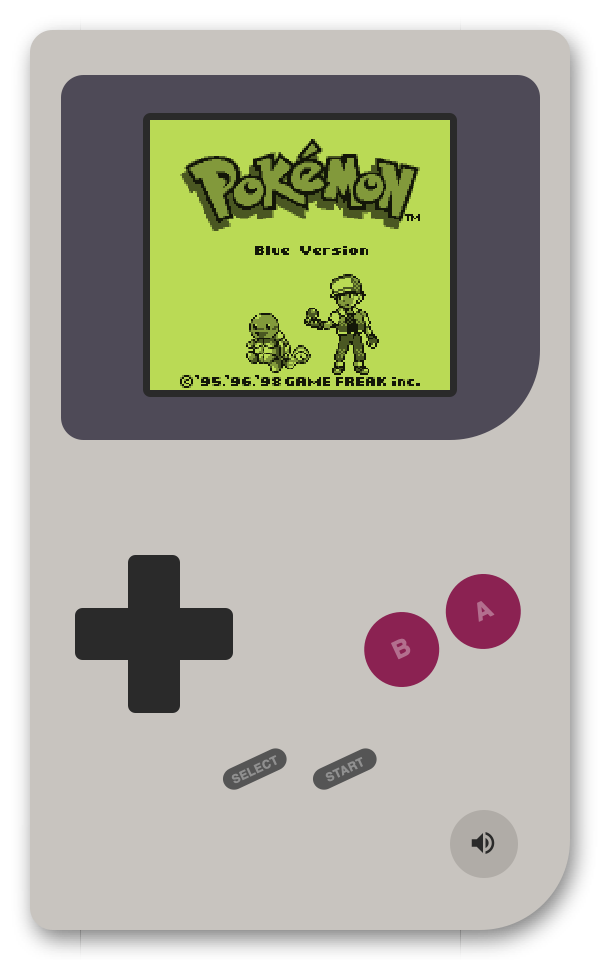

# Building a Game Boy emulator in F\#

I've been working as a software engineer for over 8 years at this point, and admittedly I've never understood how computers actually work. So I figured a good way to actually learn how they work would be to try and emulate one. Sorry Ben Eater, I'm not going to build one just yet. 

I spent hundreds of hours as a kid catching Pokémon, and so the Game Boy was the perfect candidate: real hardware, relatively simple in scope, and something with a strong personal connection.

Instead of jumping straight into it, I first did [From NAND to Tetris](https://www.nand2tetris.org/). It was a great course, and it made me really understand the fundamentals of computers, like registers, memory, and the ALU. Then to get used to building an emulator, I built a CHIP-8 emulator in F#: [Fip-8](https://github.com/nickkossolapov/fip-8).

A few months later, and after many nights of going to bed at 2 AM even though I told myself I'd only work on it for an hour or two, I have a working Game Boy emulator: Fame Boy.


## How it works

I knew I wanted to have the emulator working on both web and desktop, so I focused on having a simple interface between the emulator core, and whatever frontend is running it.

The interface between the frontends and core is essentially just two arrays and two functions:
- `framebuffer` - 144 \* 160 length array of shades (white, light, dark, black).
- `audiobuffer` - a ring audio buffer at sample rate of 32768 Hz with read and write heads.
- `stepEmulator()` - a function that goes through 1 CPU instruction and returns the number of cycles taken.
- `getJoypadState(state)` - a callback for the frontend to give the emulator the joypad state, usually once a frame.


I tried to model Fame Boy in similar way to the actual hardware of the Game Boy.

The [CPU](../src/FameBoy/Cpu/), like the real Sharp LR35902 in the Game Boy, knows nothing about the hardware except a memory map (and the IoController for interrupt signals only). It's also the most F#-ish part of my codebase, leaning heavily into functional domain modelling.

[Memory.fs](../src/FameBoy/Memory.fs) holds most of the RAM used in the Game Boy, and acts as the memory map and bus between the CPU, IO Controller, and cartridge. It also shares a reference to the same VRAM and OAM RAM arrays with the PPU for performance. 

[IoController.fs](../src/FameBoy/IoController.fs) emerged when I found myself adding too much logic to Memory.fs. While a singular IO controller doesn't exist in the Game Boy hardware, handling all the hardware registers through it simplified and added safety to the interfaces for the individual components. 

The `stepper` function in [Emulator.fs](../src/FameBoy/Emulator.fs) is the glue that brings the whole emulator together, composing all the components' individual step functions:

```fsharp
let stepper () =
	// Execute a single instruction
	// Each instruction uses a different amount of cycles
	let mCycles = stepCpu cpu io
	  
	for _ in 1..mCycles do  
	    stepTimers timer io  
	    stepSerial serial io
	    // The APU technically runs at 4x CPU-cycles, but can be batched
	    stepApu apu  
	  
	// The PPU operates at 4x CPU-cycles, but can't be batched
	let tCycles = mCycles * 4  
	  
	for _ in 1..tCycles do  
	    stepPpu ppu  
	
	// Return cycles taken so the frontend run the emulator at the right speed
	mCycles 
```

While the real hardware components all run in parallel based on a central master oscillator, my emulator is single threaded and so the components have to run in sequence. The stepper function centralises the execution and ensures that all the components are synchronised.

Lastly, for the emulator to be playable it needs to run at the correct number of cycles per second, around 17500 CPU-cycles per 60 FPS frame. The frontends use the audio sampling rate to drive the emulator when the sound is on, and the frame rate to drive the emulator when it's muted. More on this later in the chapter about sound.

## Emulating the CPU and F\#

First of all, I'd like to apologise to the functional programming purists. While [my CHIP-8 emulator](https://github.com/nickkossolapov/fip-8) is completely pure (no `mutable` members and all arrays are copied for none of that side-effect nonsense), Fame Boy uses mutability liberally. The Game Boy runs *a lot* faster than the CHIP-8, and copying 16+ kB of memory a million times every second didn't seem like the smart thing to do.

So, why F# for Fame Boy? Firstly, I think its extensive typing system works really well for modelling CPU instructions. Secondly, and the most significant reason, I just really like F#. I used to work primarily in F# at my previous company, and so I'm always looking for an excuse to keep on using it in my day-to-day.

### Domain modelling

As an example why I think the CPU modelling works well in F#, I was following [Gekkio's Complete Technical Reference](https://gekkio.fi/files/gb-docs/gbctr.pdf) when implementing the CPU. I was trying to following its rough categories to break up the instructions, and ended up with something like this in [Instructions.fs](../src/FameBoy/CPU/Instructions.fs):

```fsharp
type LoadInstr =  
    | Load8Immediate of uint8
    | Load8Direct of Reg8
    | Load8Indirect
    // ... other load instructions

type ArithmeticInstr =  
    | IncrementDirect of uint8
    | IncrementIndirect of Reg8
    // ... other arithmetic instructions
```

And it wasn't just the load instruction. A lot of the other instructions shared similar concepts, like location of the instruction's operand: 
- read 8 bit right immediately after the instruction (`immediate`),
- read/write a CPU register (`direct`), 
- read/write a memory location specified by the HL CPU register (`indirect`). 

Even though this is a small domain and most Game Boy devs know the instructions basically as is, I just felt like it could be cleaner. The code below shows the extraction of that location concept. The below code uses different names from the source code using to make the load instruction more readable.

```fsharp
type To =  
	| Immediate of uint8  
	| Register of Register // direct
	| HL // indirect

type From =  
	| Register of Reg8  // direct
	| HL // indirect

type LoadInstr =  
    | Load of From * To
    // ... other load instructions
```

This helped reduce the CPU instructions down from 512 opcodes to just 58 instructions. And in doing so, the type system in Fame Boy still maintained the ability to not represent illegal states (except one cheeky exception). The danger with generalising a domain is that bugs can be allowed at a fundamental level. So if I didn't have the `To` and `From` with different cases, a potential instruction could be `Load(From.Register D, To.Direct)`, or store a value from the D register to the value immediately after the instruction. The Game Boy hardware doesn't support that, and by having different cases you cannot express that instruction in Fame Boy without a compiler error.

Now the eagle-eyed Game Boy emulator devs would say to me "hey, what about the opcode 0x76?", and I would reply "A monad is a monoid in the category of endofunctors" to show that I'm using a functional programming language and therefore smarter than them.

Joking aside though, it's a compromise I decided on because I felt it simplified the CPU domain a lot. If you look at the patterns that the opcodes follow, `0x76` would be `Load(From.HL, To.HL)`, or load the 8 bit value from the memory at location HL to the memory at location HL. Logically, it's a NOP and not dangerous, and the opcode reader will actually decode that opcode to `HALT` as it should does in the Game Boy. But it's a notable blemish in what I think is otherwise a decent domain model.

Now you can do something similar in most languages, but if you've worked with a functional language it's hard to properly describe how smooth it feels working with these types. After using a `match` statement or Options in F#, going back to a `switch` statement feels clunky prone to mistakes. For anyone who hasn't worked with a functional programming language I'd recommend you go out and try one.

### Keep it simple, stupid

Since this goal of this project was to learn about computer hardware than building the best emulator, I almost never looked at other emulators' code in depth. However, I did take a look the source code for [CAMLBOY](https://github.com/linoscope/CAMLBOY), and spotted this line:

```ocaml
set_flags ~h:false ~z:(!a = zero) ();
```

(CAMLBOY is a great repo btw, with a pretty good blog too. You should check it out).

I really liked the way the function that allows you to pass in however many parameters you wanted in whatever order in order to compose different flag values into a single value for the flag CPU register.

But I couldn't find something exactly like it because F# avoids method overloading and default parameters due it's type system supporting partial application. Instead I settled on something like this:

```fsharp
cpu.setFlags [ Half, false; Zero, a = 0uy ]
```

It never sat well with me, but I carried on as I wanted to make progress. As I got near the end, I spent a lot of time revisiting my old code and refactoring, and wanted try and improve the setFlags function. So after a lot of mulling over and trying out other approaches, I ended up with this ([Cpu/State.fs L81](https://github.com/nickkossolapov/fame-boy/blob/acd4cebb91d20ab88316c466112e9dc47324c2d1/src/FameBoy/Cpu/State.fs#L81)):

```fsharp
// Cpu/State.fs Flags module
let inline setZ (v: bool) (f: uint8) =  
    if v then f ||| ZMask else f &&& ~~~ZMask

// Other files
cpu.Flags <- 
	cpu.Flags 
	|> setH false
	|> setZ (a = 0uy)
```

 The functions express the exact idea I wanted, and are simple, testable, and compose very well. *Chef's kiss*. The previous function required hoisting the values into DU types putting them in an array, and the setFlags function was more verbose because it. Furthermore, because the functions were inline and didn't require any heap allocations, the new functions were actually much more performant, increasing the emulator's performance by about 10%. I think that simple 12 line module is possibly my favourite F# I've ever written.

### Testing

I initially tackled the CPU with just this function and running the Tetris ROM:

```fsharp
match opcode with  
| 0x00 -> Nop  
| _ -> failwith "Unimplemented opcode"
```

And then every time it hit that exception I would implement the instruction for that opcode. I  quickly hit two issues with this approach: the loop was getting a bit tedious navigating around technical references, and I had no idea if I was actually implementing the instructions correctly. 

Fixing both of these was relatively simple, unit tests. Focusing on unit tests instead of a ROM meant I had a bit more confident in the code I was writing, and it also allowed me to move the reference technical material linearly. Gone were the days where half my time was spent tabbing between opcode tables and technical specs and coding blind.

This is where AI really came in handy. To improve my learning I wanted to write the emulator code myself, but coming up with test cases would be tedious, and I may have tunnel vision and miss some important test cases. So I had two prompts I used where I just copied the spec from the technical docs, and asked it for tests. While it was busy I read the spec myself, and then implemented the logic until the tests passed, true test-driven development style. It even helped catch a few bugs in the existing instructions I had already implemented. 

I did regularly review and improve the tests, but overall I feel it didn't detract from my learning at all, and helped me spend my energy on the things that were actually interesting to me.

## The other components

### PPU

The Game Boy doesn't have a GPU, it has a PPU, picture processing unit. Although in my mind it actually stands for pixel processing unit, because while building I spent more time focused on the individual pixels than any sort of picture.

This is the part that surprised me when it came to blogs from other people who made Game Boy emulators. Many blogs focused on the CPU, with only a few paragraphs for the PPU. Maybe it's because I was fresh off of From Nand to Tetris and the CHIP-8 emulator, the CPU felt straight forward, while the PPU took a lot longer to understand.

At the start of implementing the PPU, I was a bit lost on where to get started. So rather than trying to grok the pixel FIFOs and full PPU pipeline, I just decided to read the tiles and background map from memory, parse the data, and just put it on the screen (the right part of the screenshot below). At the time it was great because I could finally see my CPU working, and thanks to Tetris' simplicity, I could see something that was *mostly* a real Game Boy game. It felt great seeing it for the first time.


And for the PPU, starting with the tile and background view was a great point to start in hindsight. It helped me at pretty much every point in the process, from implementing the actual screen to debugging the annoying little details with the tile data. 

Overall I was happy with how the PPU turned out, but it has possible the biggest hardware inaccuracy my emulator. The Game Boy uses a queue to put pixels on the screen one at a time like a CRT monitor, but my emulator renders the entire scanline as the start of the draw period for that line. So games where the engineers took the Game Boy hardware to its limits and exploited the PPU inter-line drawing won't work with my emulator (like Prehistorik Man). But most games aren't that adventurous with the hardware, and mostly work fine with Fame Boy. Plus scaneline rending is much faster and kept the code simpler.

### Joypad

TODO kept on breaking the joypad because games read it twice for all of the inputs, so caching was hard

### Sound is hard

TODO 
- When starting audio, decided pretty quickly to not use timer clock to drive the emulator (foreshadowing). Audio driven vs frame driven.
- Windows had really weird issue with 800 buffer size not working (even though it worked when doing framerate driven clock).
- Audio is definitely the leakiest part of the emulator-frontend interface, but that's because audio does need to be precisely synced for performance. I could increase the ring size buffer and allow reading and writing to be independent, but that would introduce a lot of lag

## Taking it to the web with Fable

TODO WebAssembly Register uint8 clamping, and simplicity

## Trying to improve performance

TODO

## It's 2026, so a bit on AI

No software is free from the influence of AI these days, even learning projects. In general I strive to be transparent about my AI usage, and so I wanted to comment on how I used it and my experience with it in a purely learning project.

TODO How I used AI, the timing winter, and some optimising at the end

## Overall experience 

TODO


